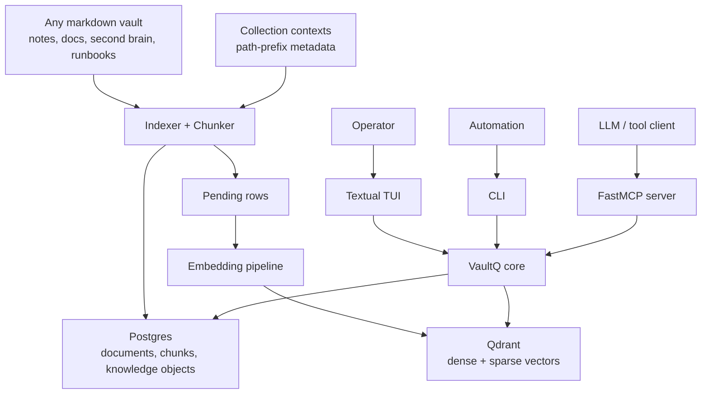
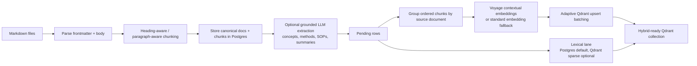
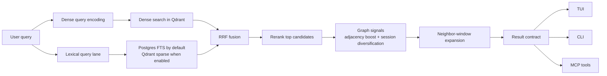
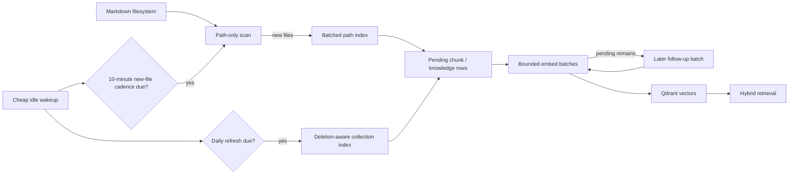

# VaultQ

Portable TUI, CLI, and MCP tooling for turning any markdown vault into a retrieval-grade knowledge system.

VaultQ is built for the cases where plain keyword search is not enough and plain vector search is still too weak. It keeps markdown as the source of truth, stores canonical docs and chunks in Postgres, stores retrieval vectors in Qdrant, and exposes the corpus through a Textual operator UI, automation-friendly CLI, and FastMCP server.

It is designed to work on any vault path, not one machine. Collections are registered explicitly, config lives in `.vaultq/config.json` or `VQ_CONFIG_DIR`, and runtime/provider settings come from `.env`, `.env.local`, or `VQ_ENV_FILE`.

The tested default provider path is Atlas-hosted Voyage models on `https://ai.mongodb.com/v1`. Direct Voyage endpoints on `https://api.voyageai.com/v1` are also supported. `vq doctor --live` detects the common mismatch where a key works on Atlas but not on the direct Voyage endpoint.

## Why VaultQ

Most note-search tools stop at one of these layers:

- lexical search only
- single-vector semantic search only
- reranking without context-aware chunk preparation
- local-only tooling that quietly assumes one fixed filesystem layout

VaultQ is aimed at a higher bar:

- heading-aware, token-aware markdown chunking
- contextual Voyage-style embeddings from raw ordered chunk groups
- lexical retrieval that still works in a stock local install
- dense retrieval in the same collection
- reciprocal-rank fusion
- reranking
- graph-aware adjacency and session-diversity scoring signals
- neighboring chunk windows on final results
- optional grounded LLM extraction into reusable knowledge objects
- TUI for operators, CLI for scripts, MCP for agents

## System Overview



## Retrieval Stack

VaultQ follows the reference pattern that performed best in the sibling retrieval projects:

1. Markdown is chunked by structure first, not by blind fixed-size splits.
2. Chunk groups from the same source document are sent together for contextual embeddings when the provider supports it.
3. Dense retrieval runs in Qdrant and the lexical lane runs either through Postgres FTS by default or Qdrant sparse vectors when explicitly enabled.
4. Results are fused with reciprocal-rank fusion instead of picking one scoring method.
5. A reranker refines the candidate set.
6. Final hits are expanded with neighboring chunks so answers are not returned as isolated fragments.

That sequence is what makes the system meaningfully better than a simple embeddings-only note search.

## Ingest And Embedding Flow



## Retrieval Flow



## What The Tool Actually Provides

- `vq` with no arguments launches the Textual TUI
- `vq init` bootstraps local config, Postgres schema, and a compatible Qdrant collection
- `vq collection add` registers any markdown root path
- `vq context add` attaches inherited context to a whole collection or path prefix
- `vq index` scans changed markdown files, rewrites chunks, and optionally writes knowledge objects
- `vq embed` embeds any pending chunks and knowledge objects
- `vq watch` keeps the vault warm with low-impact defaults: idle wakeups do no filesystem scan, new markdown discovery runs as a path-only scan every 10 minutes, and changed/deleted-file chunk refresh runs at most daily unless you override the scheduler flags
- `vq query` runs hybrid retrieval with reranking; `--mode focused` returns concise, source-diverse related-work results without neighbor-window expansion
- `vq related` surfaces source-diverse existing notes that may connect to an idea before an agent creates a new node
- `vq clusters semantic` clusters any seed node set by shared semantic anchors in the indexed corpus; `--session-policy penalize` uses adaptive session-log reranking plus a per-seed cap instead of treating transcripts as a normal pool
- `vq search` runs keyword retrieval only
- `vq vsearch` runs dense retrieval only
- `vq fetch` returns a single indexed point with expanded neighboring context
- `vq get` returns the stored source document, its chunks, and its knowledge objects
- `vq chunks stats` reports chunk token/character distribution, embedding coverage, and long-chunk outliers
- `vq background status` shows the DB-backed state of the MCP-tied background indexing worker
- `vq agent prepare` prepares the agent workspace runtime without starting a background worker
- `vq agent maintain` runs one autonomous, reversible self-maintenance pass with workspace promotion, safety receipts, idea clustering, and a human-facing update note
- `vq mcp` runs the retrieval surface as an MCP server

Graph signals are intentionally lightweight and fail open. If the local graph index is empty or stale, retrieval still returns the fused/reranked results. When graph data exists, notes linked by at least two other top candidates get a small adjacency boost, and duplicate session-like/run-like results are gently demoted so an agent sees more diverse evidence.

## Standalone And Portable By Design

VaultQ is not wired to one workstation:

- collection roots are stored as explicit paths you choose
- config defaults to a local `.vaultq/config.json` in the working directory
- `VQ_CONFIG_DIR` can move config anywhere
- `VQ_ENV_FILE` can point to any runtime env file
- `VQ_EMBED_ENV_FILE` can point at another MCP embedding env; VaultQ imports only provider/rerank keys from it, not its database settings
- database and Qdrant addresses come from environment variables
- provider settings are generic OpenAI-compatible HTTP settings rather than project-specific glue

The only assumption is that you provide a running Postgres, a running Qdrant, and the provider credentials you want to use.

## Installation

```bash
git clone https://github.com/Timandilu/vaultq.git
cd vaultq

python -m venv .venv
source .venv/bin/activate
pip install -e .

cp .env.example .env
docker compose up -d
```

The bundled `docker-compose.yml` starts a local Postgres + Qdrant stack with the same defaults used by `.env.example`.

## Quick Start

### 1. Initialize the local runtime

```bash
vq init
vq doctor --live
```

### 2. Register any markdown vault

```bash
vq collection add /path/to/your/vault --name notes
```

### 3. Add optional collection or path-prefix context

```bash
vq context add vaultq://notes "Personal knowledge vault"
vq context add vaultq://notes/projects "Project notes, operating docs, and runbooks"
```

### 4. Index the vault

Chunks only:

```bash
vq index --collection notes --skip-knowledge
```

Chunks plus knowledge extraction:

```bash
vq index --collection notes
```

### 5. Embed pending rows

```bash
vq embed
```

### 6. Query the vault

```bash
vq query "how do we run the deployment checklist?"
```

### 7. Keep the vault warm with low-impact watch mode

For background use, start from the current path-only filesystem baseline so
startup does not trigger a full index:

```bash
vq watch --no-initial-sync
```

## Agent-Native Operation Docs

VaultQ now has dedicated operational docs for agent usage:

- [Agent-native operations](docs/agent-native-operations.md)
- [Retrieval and embedding](docs/retrieval-and-embedding.md)
- [MCP and client integration](docs/mcp-and-client-integration.md)
- [VaultQ agent workspace usage guide](docs/vaultq-agent-workspace-how-to-use.md)

For the Second Brain runtime, the intended agent namespace is `14_Agent_Workspace`, and default retrieval excludes `88_Agents/sessions/**` so stale imported session transcripts do not dominate normal agent queries.

Useful watch flags:

- `--collection notes` to watch one configured collection
- `--interval 300` to control the cheap scheduler wakeup; this does not scan the vault unless a slower cadence is due
- `--new-file-index-delay-seconds 600` to run path-only new-file discovery and batch newly created markdown files
- `--changed-index-interval-seconds 86400` to refresh edited/deleted-file chunks at most daily
- `--pending-embed-interval-seconds 300` to check for pending embeddings left by other processes and drain them in the background
- `--embed-limit 100` to cap one embed batch
- `--max-embed-batches 1` to control how aggressively the queue drains per cycle
- `--with-knowledge` to also run grounded knowledge extraction during watch indexing
- `--max-loops N` for smoke tests and controlled runs

## Background Watch Mode

Watch mode is the operational bridge between one-shot batch ingest and a continuously usable vault without taking over the machine.

- it wakes a cheap scheduler loop instead of scanning the vault on every tick
- it uses a path-only filesystem scan on the new-file cadence instead of statting every markdown file every poll
- it indexes newly discovered files together and then embeds the resulting chunks in bounded batches
- it refreshes changed/deleted-file chunks through the deletion-aware `vq index` path at most daily
- it drains pending embeddings in bounded batches, including vectors left behind by foreground index/write commands, and schedules later follow-up batches when vectors remain
- it works for arbitrary vault roots because the watcher only relies on registered collection paths

### Watch Loop



## TUI

The TUI is the main operator surface.

```bash
vq
```

or explicitly:

```bash
vq tui
```

The current TUI exposes:

- an overview of store, retrieval, and chunk length health
- collection registration
- pipeline controls for init, index, embed, watch start/stop, and doctor
- agent runtime controls for autonomous workspace maintenance, idea clustering, and the human-facing update note
- search across hybrid, semantic, and keyword modes
- MCP launch guidance

## Using VaultQ As MCP

VaultQ can run as a local MCP server for Codex, Antigravity, Claude Desktop, local agent loops, and demos.

Start it with STDIO transport:

```bash
vq mcp --transport stdio --no-banner
```

HTTP transport is also available for clients that support it:

```bash
vq mcp --transport http --host 127.0.0.1 --port 7073
```

The MCP surface exposes retrieval tools plus policy-gated agent-write tools. Writes are constrained by the configured vault policy and property schema; by default, agent writes belong under `14_Agent_Workspace`. Agents should call `vaultq_write_status` before creating notes when they are unsure about allowed `type`, `domain`, tags, or optional properties.

- `vaultq_status`: returns store and retrieval status
- `vaultq_collection_list`: returns locally configured collections and contexts
- `vaultq_operation_list`: lists declared operations and parameter contracts
- `vaultq_chunk_stats`: returns chunk length distribution, embedding coverage, and longest chunk samples
- `vaultq_background_status`: returns DB-backed state for the MCP-tied background index worker
- `vaultq_search`: runs keyword-only retrieval
- `vaultq_query`: runs the hybrid retrieval path; `mode` can be `fast`, `focused`, `balanced`, `deep`, or `hybrid`
- `vaultq_related_work`: surfaces source-diverse existing notes that may connect to an idea before writing a new note
- `vaultq_semantic_clusters`: clusters arbitrary seed notes by shared semantic anchors across indexed notes, imported texts, and explicitly requested session logs; penalized session logs are adaptively reranked and capped per seed
- `vaultq_get_doc`: fetches a source document or cited chunk by `rel_path`, `#document_id`, point id, `chunk:<id>`, or `knowledge:<id>`
- `vaultq_write_status`: shows write policy, property schema, and AI workspace status
- `vaultq_capture`: creates an agent-authored note in the AI workspace
- `vaultq_note_propose`: writes a proposal note under the AI workspace, without canonical vault promotion
- `vaultq_note_put`: creates or replaces an allowed note path
- `vaultq_note_append`: appends text to an allowed note path
- `vaultq_property_propose`: proposes a new property or tag rule without approving it
- `vaultq_graph_extract`: extracts wikilinks, markdown links, and frontmatter graph edges into the local index
- `vaultq_graph_neighbors`: lists outgoing links for a note
- `vaultq_graph_backlinks`: lists backlinks for a note or identifier
- `vaultq_graph_traverse`: follows graph edges by direction, depth, and optional edge type
- `vaultq_agent_prepare`: prepares a disabled, reversible review/promote runtime and optional diff sheet; it does not start a background worker
- `vaultq_agent_maintain`: runs one autonomous, reversible self-maintenance pass inside `14_Agent_Workspace`, writes ledgers, safety receipts, idea clusters, and the human-facing workspace update note
- `vaultq_think`: creates a lightweight cited synthesis from retrieval results
- `vaultq_maintain`: inspects the AI workspace and can write a maintenance report

When `VQ_BACKGROUND_INDEX_COLLECTION` is set for the MCP process, VaultQ also starts a low-impact background upkeep worker. The worker starts from a path-only filesystem baseline, avoids a full startup index, wakes cheaply every 5 minutes by default, discovers new markdown files with a path-only scan every 10 minutes, checks for pending embeddings every 5 minutes, refreshes changed/deleted-file chunks on the configured daily interval using stored file size/mtime metadata, and uses small embed batches so retrieval freshness does not take over the machine. The worker writes status into Postgres, visible through `vaultq_background_status` or `vq background status --json`.

When `VQ_SELF_MAINTAIN_INTERVAL_SECONDS` is set above zero, the MCP process also
starts the official state-gated self-maintenance loop. The Windows
`start_vaultq_mcp.bat` enables it for the `second_brain` collection; portable
installs keep it disabled by default.

Each tool returns:

```json
{
  "ok": true,
  "data": {}
}
```

Errors are returned as structured payloads:

```json
{
  "ok": false,
  "error": {
    "type": "RuntimeError",
    "message": "No API key configured for Embedding request",
    "hint": "Check that Postgres, Qdrant, and the embedding/rerank provider settings are available."
  }
}
```

### Codex MCP Config

Example `~/.codex/config.toml` entry:

```toml
[mcp_servers.vaultq]
command = "/path/to/vaultq/.venv/bin/vq"
args = ["mcp", "--transport", "stdio", "--no-banner"]

[mcp_servers.vaultq.env]
VQ_CONFIG_DIR = "/path/to/vaultq-runtime/config"
VQ_ENV_FILE = "/path/to/vaultq-runtime/.env"
```

### Claude Desktop MCP Config

Example `claude_desktop_config.json` entry:

```json
{
  "mcpServers": {
    "vaultq": {
      "command": "/path/to/vaultq/.venv/bin/vq",
      "args": ["mcp", "--transport", "stdio", "--no-banner"],
      "env": {
        "VQ_CONFIG_DIR": "/path/to/vaultq-runtime/config",
        "VQ_ENV_FILE": "/path/to/vaultq-runtime/.env"
      }
    }
  }
}
```

Use absolute paths in client configs. `VQ_CONFIG_DIR` should point at the directory containing `config.json`, and `VQ_ENV_FILE` should point at the env file with Postgres, Qdrant, and provider settings.

### MCP Smoke Transcript

This transcript was produced against a disposable three-note corpus with a local fake embedding provider, local Postgres, and local Qdrant.

```text
$ vq query "what should happen after smoke tests?" --json
top result: ops/release.md
text: After smoke tests pass, ship the release and watch metrics for fifteen minutes.

$ MCP tools/list
vaultq_status
vaultq_collection_list
vaultq_operation_list
vaultq_search
vaultq_query
vaultq_get_doc
vaultq_write_status
vaultq_capture
vaultq_property_propose

$ MCP vaultq_query {"query":"what should happen after smoke tests?","limit":3}
ok: true
top result: ops/release.md

$ MCP vaultq_get_doc {"identifier":"ops/release.md","full":false}
ok: true
title: Release Checklist
chunks: 1
```

### MCP Troubleshooting

- `No API key configured`: set `VOYAGE_API_KEY`, `EMBED_API_KEY`, or the provider-specific key in `VQ_ENV_FILE`.
- `connection refused` from Postgres or Qdrant: run `docker compose up -d` or point `DB_*` / `QDRANT_URL` at the right services.
- `collections` is empty: run `vq collection add /path/to/vault --name notes` with the same `VQ_CONFIG_DIR` used by the MCP client.
- `Qdrant dense vector size mismatch`: check `EMBEDDING_DIM`, then recreate the test collection with `vq init --reset` if needed.
- Claude or Codex cannot start the server: use absolute paths for `command`, `VQ_CONFIG_DIR`, and `VQ_ENV_FILE`, then test the same command directly in a shell.

## Knowledge Extraction

Knowledge extraction is optional on purpose.

When `LLM_API_KEY` and the related `LLM_*` settings are configured, `vq index` can produce grounded knowledge objects such as:

- `document_summary`
- `segment_summary`
- `concept`
- `principle`
- `method`
- `sop`

Those objects are stored in Postgres like any other indexed asset and can also be embedded into Qdrant for retrieval.

If you want the cheapest possible first pass, use:

```bash
vq index --skip-knowledge
vq embed --kinds chunks
```

## Accuracy Notes

The retrieval path is tuned for answer quality rather than minimal moving parts:

- chunks carry structural metadata such as title, heading path, line ranges, and inherited contexts
- contextual chunk embeddings use raw ordered source groups when contextual embeddings are enabled
- contextual groups are bounded by outbound text estimates so very long notes do not block corpus embedding
- lexical retrieval stays enabled by default because exact terms still matter heavily in markdown corpora
- reranking is enabled by default because fusion alone is not enough on ambiguous note queries
- neighbor windows are added by default so the returned text contains the local paragraph neighborhood

If you disable contextual embeddings, VaultQ falls back to standard embedding requests over metadata-enriched text.

For portability, the default lexical backend is Postgres full-text search. If you have a Qdrant deployment with sparse inference configured, set `SPARSE_BACKEND=qdrant` to move the lexical lane fully into Qdrant.

## Runtime Configuration

The main environment contract is:

| Area | Variables |
| --- | --- |
| Postgres | `DB_HOST`, `DB_PORT`, `DB_NAME`, `DB_USER`, `DB_PASS`, or `DATABASE_URL` |
| Qdrant | `QDRANT_URL`, `QDRANT_COLLECTION`, `QDRANT_PORT`, `QDRANT_GRPC_PORT` |
| Embeddings | `VOYAGE_API_KEY`, `EMBED_PROVIDER`, `EMBED_BASE_URL`, `EMBED_MODEL`, `EMBED_API_KEY`, `EMBEDDING_DIM` |
| Contextual batching | `ENABLE_CONTEXTUAL_EMBEDDINGS`, `CONTEXTUAL_WINDOW_TOKENS`, `CONTEXTUAL_WINDOW_MAX_CHUNKS`, `CONTEXTUAL_TEXT_MAX_TOKENS`, `CONTEXTUAL_REQUEST_MAX_GROUPS`, `CONTEXTUAL_REQUEST_MAX_DOCUMENTS`, `CONTEXTUAL_REQUEST_MAX_TOKENS` |
| Sparse retrieval | `ENABLE_SPARSE_RETRIEVAL`, `SPARSE_BACKEND`, `SPARSE_VECTOR_NAME`, `QDRANT_SPARSE_MODEL` |
| Reranking | `ENABLE_RERANKER`, `RERANK_BASE_URL`, `RERANKER_MODEL`, `RERANK_API_KEY`, `RERANK_CANDIDATES`, `NEIGHBOR_WINDOW_SIZE` |
| Optional LLM extraction | `LLM_BASE_URL`, `LLM_MODEL`, `LLM_API_KEY`, `LLM_MAX_OUTPUT_TOKENS`, `LLM_TIMEOUT`, `LLM_RETRIES`, `LLM_TPM_LIMIT` |
| Runtime location | `VQ_CONFIG_DIR`, `VQ_ENV_FILE` |
| MCP-tied self-maintenance | `VQ_SELF_MAINTAIN_COLLECTION`, `VQ_SELF_MAINTAIN_INTERVAL_SECONDS`, `VQ_SELF_MAINTAIN_INITIAL_DELAY_SECONDS`, `VQ_SELF_MAINTAIN_MAX_ACTIONS`, `VQ_SELF_MAINTAIN_STATE_FILE` |
| MCP-tied background index | `VQ_BACKGROUND_INDEX_COLLECTION`, `VQ_BACKGROUND_INDEX_ENABLED`, `VQ_BACKGROUND_INDEX_POLL_SECONDS`, `VQ_BACKGROUND_INDEX_INITIAL_DELAY_SECONDS`, `VQ_BACKGROUND_NEW_FILE_DELAY_SECONDS`, `VQ_BACKGROUND_CHANGED_INDEX_SECONDS`, `VQ_BACKGROUND_PENDING_EMBED_SECONDS`, `VQ_BACKGROUND_EMBED_LIMIT`, `VQ_BACKGROUND_MAX_EMBED_BATCHES` |

See [.env.example](./.env.example) for the current full set of defaults.

## Common Command Patterns

```bash
vq doctor --live
vq init
vq collection add /path/to/vault --name notes
vq context add vaultq://notes/clients/acme "Acme client work"
vq index --collection notes --skip-knowledge
vq embed --kinds chunks --limit 200
vq query "release checklist"
vq fetch <point-id>
vq get notes/project/release.md --full
vq mcp --transport stdio
```

## Verification

Fast checks:

```bash
python -m compileall src
python -m vaultq.cli --help
python -m vaultq.cli doctor --live
python -m vaultq.cli mcp --help
```

Local stack:

```bash
docker compose up -d
python -m vaultq.cli init
python -m vaultq.cli status --json
```

End-to-end bootstrap on a real vault:

```bash
python -m vaultq.cli collection add /path/to/vault --name notes
python -m vaultq.cli index --collection notes --skip-knowledge --json
python -m vaultq.cli embed --kinds chunks --json
python -m vaultq.cli query "your test query" --json
```

## Project Structure

```text
src/vaultq/
  cli.py              CLI entrypoint
  tui.py              Textual operator UI
  mcp_server.py       FastMCP server
  operations.py       Declared MCP/CLI operation contracts
  policy.py           Vault write policy and path safety checks
  property_schema.py  Vault frontmatter/type/domain/tag validation
  write_ops.py        Agent-authored note writes and proposals
  receipts.py         JSON receipts for mutating operations
  ai_workspace.py     AI workspace folder conventions
  graph.py            Link graph extraction, backlinks, and neighbors
  link_extraction.py  GBrain-derived wikilink/markdown/frontmatter link extraction
  think.py            Lightweight cited retrieval synthesis
  maintenance.py      AI workspace maintenance inspection/reporting
  indexer.py          Markdown ingest and update logic
  chunker.py          Heading-aware/token-aware chunking
  embed.py            Pending-row embedding and Qdrant upserts
  search.py           Hybrid retrieval, rerank, neighbor windows
  store.py            Postgres schema, config, and Qdrant bootstrap
  enrich.py           Optional grounded knowledge extraction
  retrieval_models.py Provider-aware embedding and rerank HTTP helpers
```

## Current Status

VaultQ has been improved around:

- portable runtime config
- Textual TUI as the default UX
- FastMCP server support
- contextual Voyage-style embeddings with tested Atlas defaults
- dense retrieval plus a portable lexical lane
- reranking and neighbor windows
- adaptive Qdrant upsert batching
- live provider diagnostics with endpoint mismatch detection
- idempotent local bootstrap for Postgres + Qdrant

The program is live and fully usable for agents and humans alike. 
